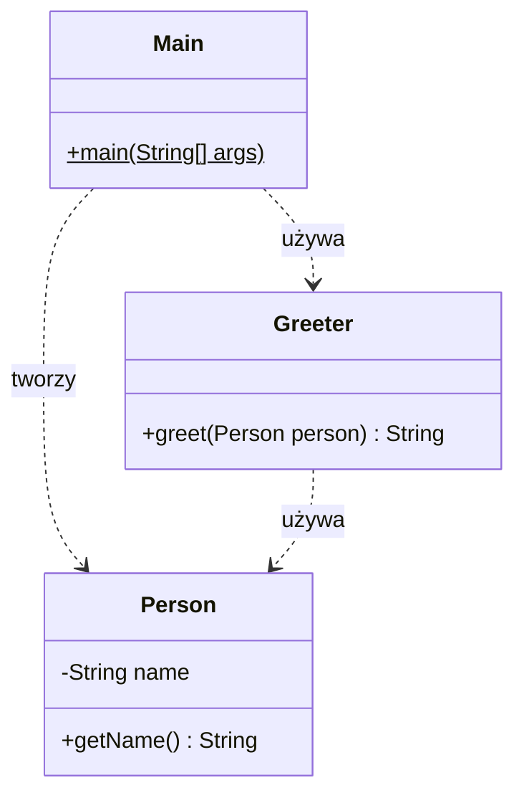

# Diagram klas

```mermaid
classDiagram
    class Main {
        +main(String[] args)$
    }
    class Person {
        -String name
        +getName() String
    }
    class Greeter {
        +greet(Person person) String
    }
    Main ..> Person : tworzy
    Main ..> Greeter : używa
    Greeter ..> Person : używa
```
